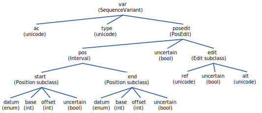
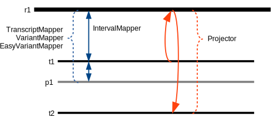

Key Concepts
!!!!!!!!!!!!

This section is intended for all users and provides an understanding
of key concepts and components of the hgvs package.

Variant Object Representation
@@@@@@@@@@@@@@@@@@@@@@@@@@@@@

HGVS variants are represented using classes that represent elemental
concepts of an HGVS sequence variant.  Each of the objects contains
references to data that define the objects; those data may be Python
built in types such as integers (int) or strings (unicode), or they
may be other classes in the hgvs package. 

For example, a variant parsed like this:

>>> var = hgvsparser.parse_hgvs_variant('NM_001197320.1:c.281C>T')

will generate an object tree like the following:

  A typical object tree created by parsing a variant. Verticies show
  the property name with property type in parentheses.

For that variant, the properties may be obtained easily by dot lookup:

>>> var.ac
u'NM_001197320.1'
>>> var.type
u'c'
>>> var.posedit
PosEdit(pos=281, edit=C>T, uncertain=False)
>>> var.posedit.pos
Interval(start=281, end=281, uncertain=False)
>>> var.posedit.pos.start, var.posedit.pos.end
(BaseOffsetPosition(base=281, offset=0, datum=1, uncertain=False),
 BaseOffsetPosition(base=281, offset=0, datum=1, uncertain=False))
>>> var.posedit.edit
NARefAlt(ref=C, alt=T, uncertain=False)

The object representation makes it easy to modify variants
conceptually rather than textually.  For example, if the previous
variant was inferred rather than sequenced, we might wish to declare
that it is uncertain, which then causes the stringified version to
contain the edit in parentheses:

>>> var.posedit.uncertain = True
>>> unicode(var)
u'NM_001197320.1:c.(281C>T)'

Variant Mapping Tools
@@@@@@@@@@@@@@@@@@@@@

Variant mapping is supported by several modules.  Most users will
likely be content with :class:`hgvs.variant.EasyVariantMapper`.  For
completeness, it may help to understand how all of the mappers relate
to each other.

  :class:`hgvs.intervalmapper.IntervalMapper`

     The IntervalMapper maps pairs of contiguous sequence intervals to
     each other. It is the "lowest" component of the mapping hierarchy
     and "knows" nothing about biological sequences.

  :class:`hgvs.transcriptmapper.TranscriptMapper`

     The TranscriptMapper uses IntervalMapper to map
     pairs of exon segments (typically exons in the transcript and
     genomic sequences). It is must be instantiated with a transcript
     accession, reference accession, and alignment method, and
     provides functions to map sequence intervals (not variants)
     for the specified alignment.  It is also accommodates strand
     orientation.

  :class:`hgvs.variantmapper.VariantMapper`

     The VariantMapper uses
     :class:`hgvs.transcriptmapper.TranscriptMapper` to provide g<->r,
     r<->c, g<->c, and c->p transformations for
     :class:`SequenceVariant` objects. As with the TranscriptMapper,
     it must be instantiated with an appropriate transcript,
     reference, and alignment method.

  :class:`hgvs.variantmapper.EasyVariantMapper`

     VariantMapper requires that the caller provide a transcript
     accession and an appropriate reference sequence, which in turn
     requires knowing the correct reference sequence. The alignment
     method is also required.  While the VariantMapper interface
     serves the general case of mapping to any sequence (including
     patch sequences), it is burdensome for the most common case.
     EasyVariantMapper wraps VariantMapper to provide identical
     mapping functionality that is tailored for mapping between a
     transcript and a primary assembly.

  :class:`hgvs.projector.Projector`

     Projector maps variants between transcripts using a common
     reference and alignment method.  For example, this tool can
     transfer a variant from one RefSeq to another, or even from an
     Ensembl transcript to a RefSeq.

  Mapping tools available in the hgvs package. r1 is a genomic
  reference (|eg| NC_000014.8). t1 and t2 are transcripts (|eg|
  NM_000551.2). p1 is a protein sequence (|eg| NP_012345.6).

External Data Sources
@@@@@@@@@@@@@@@@@@@@@

Variant mapping and validation requires access to external data,
specifically exon structures, transcript alignments, accessions, and
sequences.  In order to isolate the hgvs package from the myriad
choices and tradeoffs, these data are provided through an
implementation of the (abstract) Data Provider Interface
(:class:`hgvs.dataproviders.interface`).  Currently, the only concrete
implementation of the data provider interface uses `UTA
<https://bitbucket.org/biocommons/uta>`_, an archive of transcripts,
transcript sequences, and transcript-reference sequence alignments.

Invitae provides a public UTA instance at ``uta.biocommons.org:5432``
(PostgreSQL).  `hgvs` uses this public UTA instance by default, so
most users won't need to worry about this aspect of the hgvs package.
However, a docker image of UTA is also available; see
:ref:`installation` for details.

Alternatively, users may implement their own providers that conform to
the data providers interface. See :mod:`hgvs.dataproviders.uta` for an
example.

.. |eg| replace:: *e.g.,*
